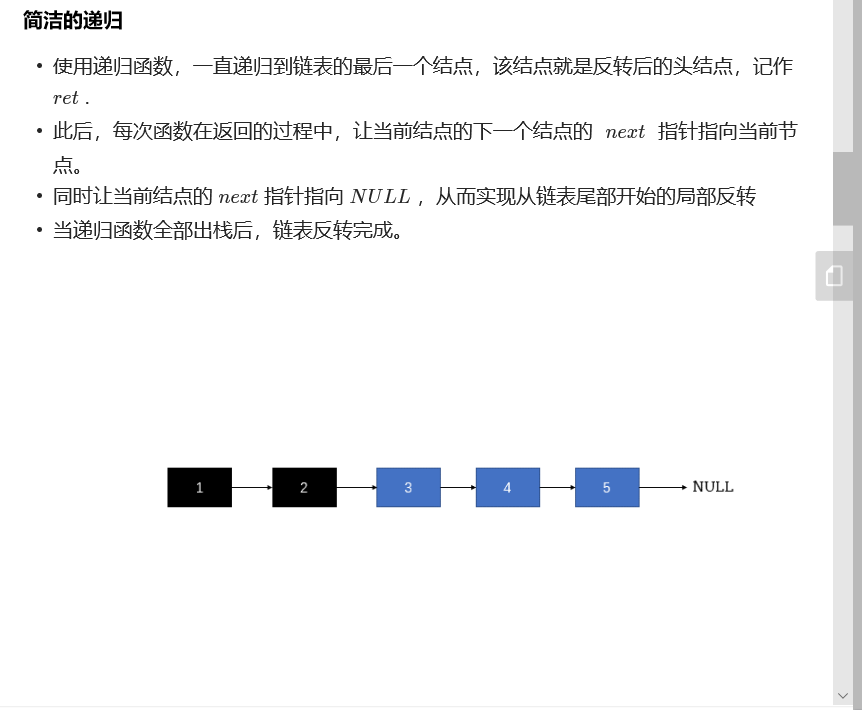

# 206链表翻转

## 1.双指针


## 2.递归？？？？




**代码**

```c++
class Solution {
public:
    ListNode* reverseList(ListNode* head) {
        if (head == NULL || head->next == NULL) {
            return head;
        }
        ListNode* ret = reverseList(head->next);
        head->next->next = head;
        head->next = NULL;
        return ret;
    }
};

作者：huwt
链接：https://leetcode-cn.com/problems/reverse-linked-list/solution/fan-zhuan-lian-biao-shuang-zhi-zhen-di-gui-yao-mo-/
来源：力扣（LeetCode）
著作权归作者所有。商业转载请联系作者获得授权，非商业转载请注明出处。
```

